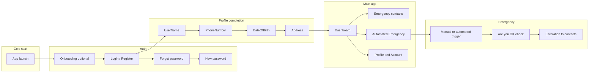
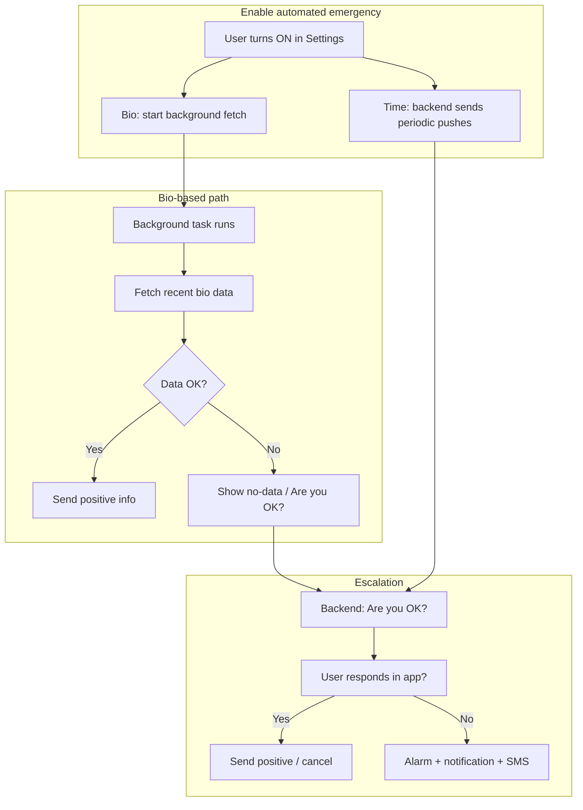

# Purpose and Business Logic

## 1. App Purpose and Scope

The **Biostasis** mobile application is a cryopreservation and emergency-contact app. Its main goals are:

- Let users **register and complete a profile** (name, phone, date of birth, address).
- Let users **manage emergency contacts** and an **emergency message** that can be sent to those contacts.
- Provide an **Automated Emergency System** that can detect when the user may be unresponsive (via health data or timed checks) and escalate to contacts if the user does not confirm they are OK.
- Support **documents** (e.g. medical directive, last will) and **profile/medical information**.
- Support **account settings** (language, notifications, GDPR export, account deletion).

The app does **not** perform cryopreservation itself; it focuses on identity/profile, emergency contacts, optional documents, and the automated emergency monitoring feature.

---

## 2. Primary User Flows

### 2.1 High-level journey

- **Unauthenticated**: User sees **Onboarding** (once, stored in `HasSeenOnboarding`), then **Auth** (login/register, forgot password, new password).
- **Authenticated but profile incomplete**: User is forced through **Sign-up** (UserName → PhoneNumber → DateOfBirth → Address). “Initialized” means name, surname, phone, dateOfBirth, and address are all set (see [userInitializedSelector](src/redux/user/selectors.ts)).
- **Authenticated and initialized**: User reaches the **main app** (Drawer + stack: Dashboard, Emergency contacts, Automated Emergency, Profile, Account, etc.).
- **Emergency**: Can be started manually or by the **Automated Emergency System**. Backend sends “Are you OK?”; if no response, escalation (alarm, notification, SMS to contacts). User can cancel or confirm OK from the app.

### 2.2 Key business concepts

| Concept | Description |
|--------|-------------|
| **Emergency contact** | A contact (name, surname, email, phone, etc.) who receives the emergency message when escalation runs. |
| **Emergency message** | User-defined text (and optionally location/documents) sent to contacts when an emergency is triggered. |
| **Time slot** | A recurring or one-off “pause” window when the automated system does not escalate (e.g. sleep hours). Stored on backend; app uses them to decide if “now” is paused. |
| **Bio-based trigger** | Automated emergency mode that uses health data (heart rate, resting heart rate, movement) from Google Fit (Android) or HealthKit/Apple Watch (iOS) to infer if the user is OK; no data or invalid data can lead to “Are you OK?” and then escalation. |
| **Time-based trigger** | Automated emergency mode where the backend sends periodic “Are you OK?” push notifications on a schedule; no health data is read by the app. |
| **Positive info** | Signal sent to the backend when the user (or their bio data) is OK, to postpone the next emergency check or cancel an ongoing escalation. |
| **Escalation** | Backend-driven flow: “Are you OK?” → no response → alarm + notification + SMS to contacts. |

---

## 3. Business Logic (Detailed)

### 3.1 Authentication

**Flow**

1. Optional **onboarding** (slides); completion is stored in AsyncStorage (`HasSeenOnboarding`).
2. **Auth** screen: login or register (email/password). Links to Forgot password and New password.
3. **Deep links** (e.g. from email):  
   - `biostasis://auth/:email/:code` — auth with email/code.  
   - `biostasis://forgot-password/:email/:code` — open New password with email/code.

**Technical references**

- Navigator: [src/navigators/AuthStack.tsx](src/navigators/AuthStack.tsx) (Onboarding, Auth, ForgotPassword, NewPassword).
- State and thunks: [src/redux/auth/](src/redux/auth/) (e.g. `isAuthed`, login/signup/forgotPassword).
- Identity provider: [src/services/Amazon.service.ts](src/services/Amazon.service.ts) (AWS Cognito, Google/Apple sign-in, `getToken()`).
- API: All authenticated requests attach the Cognito token via [src/services/API.service.ts](src/services/API.service.ts) (axios interceptor using `getToken()`).

---

### 3.2 Sign-up (profile completion)

**Rule**

- The app treats the user as **initialized** only when **name**, **surname**, **phone**, **dateOfBirth**, and **address** are all set.
- Until then, only the **SignUpStack** is shown; the main app (Drawer/MainStack) is not available.

**Screens (in order)**

1. **Void** (loading placeholder when needed).  
2. **UserName** (name, surname).  
3. **PhoneNumber** (phone, prefix, country code).  
4. **DateOfBirth**.  
5. **Address** (street, city, country, zipCode).

**Technical references**

- Initialization check: [src/redux/user/selectors.ts](src/redux/user/selectors.ts) — `userInitializedSelector` / `checkIfInitialized`.
- Navigator: [src/navigators/SignUpStack.tsx](src/navigators/SignUpStack.tsx).  
- Root navigator uses `isAuthed` and `userInitializedSelector` to choose AuthStack vs SignUpStack vs MainStack ([src/navigators/index.tsx](src/navigators/index.tsx)).

---

### 3.3 Emergency contacts

**Behavior**

- **CRUD**: Add, edit, and delete emergency contacts. List and settings live on **Emergency contacts** (and related) screens.
- **Test message**: User can send a test message from the app to verify contact/backend setup.
- Contacts are stored on the backend; the app keeps a copy in Redux (persisted, encrypted).

**Technical references**

- Screens: [src/screens/EmergencyContactsSettingsScreen/](src/screens/EmergencyContactsSettingsScreen/), [src/screens/AddNewEmergencyContactScreen/](src/screens/AddNewEmergencyContactScreen/).
- API: v1/v2 contact endpoints in [src/services/API.service.ts](src/services/API.service.ts) (get, post, patch, delete).
- State: [src/redux/emergencyContacts/](src/redux/emergencyContacts/) (slice + thunks; encrypted persistence in store config).

---

### 3.4 Automated Emergency System

This is the **core feature**: automatically detect possible unresponsiveness and escalate to emergency contacts if the user does not respond.

#### 3.4.1 Two modes

| Mode | Description | App-side behavior |
|------|-------------|-------------------|
| **Bio-based** | Uses health data (heart rate, resting heart rate, movement) from **Google Fit** (Android) or **HealthKit / Apple Watch** (iOS). | Background task runs periodically (e.g. every 15 min on Android). App fetches recent bio data; if “positive” (data present and valid), sends **positive info** to backend. If no/invalid data, shows “no data” and can open “Are you OK?”; backend can then escalate. |
| **Time-based** | No health data. Backend sends periodic “Are you OK?” push notifications at a configured interval. | App does not run bio checks. User responds via notification/app; backend only waits for positive info between the “Are you OK?” and the scheduled emergency time. |

#### 3.4.2 Activation

- User turns **Automated Emergency** ON in **Automated Emergency Settings**.
- For **bio-based** mode:
  - **Android**: [AutomatedSystemListener](src/providers/AutomatedSystemListener.tsx) starts the background fetch ([Background.service](src/services/Background.service.ts)), creates notification channels, and ensures FCM token is sent to backend.
  - **iOS**: Same listener updates data-collection status (HealthKit/Apple Watch); no background fetch in the same way (platform limits).
- Bio-based is only considered “valid” when platform conditions are met (see [UseBioTriggerValid](src/hooks/UseBioTriggerValid.hook.ts)): e.g. iOS = Apple Watch paired; Android = Google Fit connected, background enabled, and authenticated.

#### 3.4.3 Pause logic

- **Pause from now**: Single pause period starting at a chosen time (stored as `pausedDate`).
- **Specific time slots**: Recurring weekly windows (e.g. “every night 22:00–07:00”). Stored on backend; app maps them via [TimeSlot.service](src/services/TimeSlot.service/) (API ↔ local).
- **Rule**: At any moment the app checks “is now inside a pause?” using [Time.service](src/services/Time.service.ts) `isPausedTime(givenDate, pausedDate, specificPausedTimes)`. During pause, the backend may ignore positive info and not escalate; the app may still run bio checks but will not escalate during paused windows.

#### 3.4.4 Positive info and cancellation

- When **bio data is OK** or the **user taps “I’m OK”**:  
  App calls `API.positiveInfo(minutesToNext)` to tell the backend to postpone the next emergency.  
  If escalation has already started, the app may call `API.cancelEmergency()` and, for Android, stop the background fetch (see [automatedEmergency thunks](src/redux/automatedEmergency/thunks.ts) — `pushPositiveResponse`).
- Backend uses positive info to extend the “next emergency” time (bio) or to consider the check satisfied (time-based).

#### 3.4.5 Escalation and “Are you OK?”

- Backend sends “Are you OK?” (e.g. via push or deep link).
- **Deep link**: `biostasis://are-you-ok` opens [HealthConditionErrorScreen](src/screens/HealthConditionErrorScreen/) so the user can confirm they are OK or cancel the emergency.
- If the user **does not respond** in time: backend schedules alarm, sends notification, then SMS (and possibly email) to emergency contacts.
- In-app: [CancelEmergencyPopup](src/screens/CancelEmergencyPopup/) allows cancelling an active emergency from the UI.

#### 3.4.6 Technical references

- Background task and event dispatch: [src/services/Background.service.ts](src/services/Background.service.ts) (e.g. `ReactNativeBackgroundFetch` → `startBioCheck`).
- Bio data and positive info: [src/services/BioCheck.service.ts](src/services/BioCheck.service.ts) (`startBioCheck`, `checkForBioData`, `handleBioData`, `handlePositiveData`, `handleDisconnection`).
- Listener that starts/stops automated emergency (background, notifications): [src/providers/AutomatedSystemListener.tsx](src/providers/AutomatedSystemListener.tsx).
- Bio trigger validity (platform conditions): [src/hooks/UseBioTriggerValid.hook.ts](src/hooks/UseBioTriggerValid.hook.ts).
- Pause and time slots: [src/services/Time.service.ts](src/services/Time.service.ts), [src/services/TimeSlot.service/](src/services/TimeSlot.service/), [src/redux/automatedEmergency/](src/redux/automatedEmergency/).

---

### 3.5 Documents

- Users can **upload**, **list**, and **delete** documents (e.g. medical directive, last will, other).
- Stored on backend; category and file metadata are used for display and access control (e.g. “uploaded documents access” in emergency settings).

**Technical references**

- API: file endpoints in [src/services/API.service.ts](src/services/API.service.ts) (get, delete, upload). Types in [src/services/API.types.ts](src/services/API.types.ts) (e.g. `IFile`, `UploadFileCategoryType`).
- State: [src/redux/documents/](src/redux/documents/).

---

### 3.6 Profile and account

- **Profile**: Default view, edit (name, surname, phone, address, etc.), and **medical info** (e.g. primary physician, diagnosis, last hospital visit). All profile fields live in the user slice ([src/redux/user/user.slice.ts](src/redux/user/user.slice.ts) — `IUser`).
- **Account settings**: Language, notification/tips toggles, GDPR export, delete account. GDPR export and related state: [src/redux/gdpr/](src/redux/gdpr/); API export endpoint in [API.service](src/services/API.service.ts).

---

### 3.7 Validation

- **Centralized** validation uses **Yup** schemas in [src/services/Validation.service.ts](src/services/Validation.service.ts).
- Covers: password, email, userName (with character rules), address (street, city, country, zipCode), diagnosis, emergency message, and composed schemas for sign-in, sign-up, confirm password, add emergency contact, emergency settings, edit profile, medical info.
- Error messages can use app translation (`useAppTranslation`).

---

## 4. User journey (emergency flow)

This diagram summarizes: enabling the system, the bio-based path (background → bio data → positive vs “no data”), and the shared escalation path (Are you OK? → respond or escalate).
