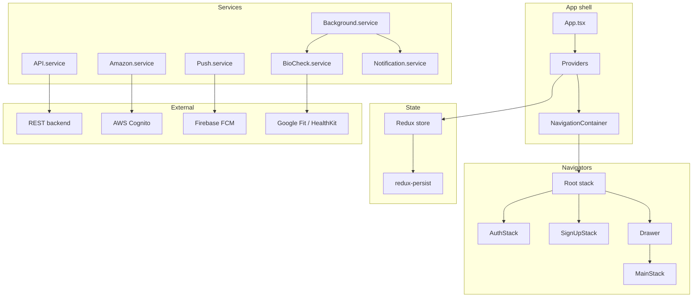

# Technical Architecture

## 1. Tech stack

| Layer | Technology |
|-------|------------|
| **Framework** | React Native **0.76.7** (bare/CLI, no Expo) |
| **Language** | TypeScript |
| **UI** | React 18, Native Base 3, styled-components, NativeWind (Tailwind-style) |
| **State** | Redux Toolkit |
| **Navigation** | React Navigation 7 (stack + drawer) |
| **Auth** | AWS Amplify / Cognito (Google & Apple sign-in) |
| **Backend** | REST API (axios); base URL from env |
| **Push / analytics** | Firebase (Cloud Messaging, Crashlytics) |
| **Local notifications** | Notifee |
| **i18n** | i18next / react-i18next |
| **Background** | react-native-background-fetch (Android) |

**Build variants**

- **Android**: development/staging flavors (e.g. `android:dev`, `android:staging`).
- **iOS**: schemes (e.g. `BiostasisDevelopment`, `BiostasisStaging`).

---

## 2. High-level architecture

---

## 3. Entry and app shell

**Entry chain**

1. **`index.js`** (repo root)  
   - Registers gesture handler, get-random-values, Firebase messaging.  
   - Registers headless background task (Android).  
   - Sets Firebase background message handler.  
   - `AppRegistry.registerComponent(appName, () => App)` with `appName` from `app.json` (`"Biostasis"`).  
   - Imports `App` from `./App`.

2. **`App.tsx`** (repo root)  
   - Wraps the app in **Providers** and renders **NavigationContainer** from `~/navigators` (i.e. [src/navigators/index.tsx](src/navigators/index.tsx)).  
   - Sets up StatusBar, SplashScreen, Crashlytics, AWS init, i18n, foreground push handler.

3. **Providers** ([src/providers/Providers.tsx](src/providers/Providers.tsx))  
   - **Redux** `Provider` + **PersistGate**.  
   - **AuthListener** (auth state, FCM token sync).  
   - **AutomatedSystemListener** (start/stop background fetch and notification when automated emergency is toggled).  
   - **SafeAreaProvider**, **NativeBaseProvider**, **EmergencyButton** (emergency countdown/UI).

No screen tree is defined in `App.tsx`; all screens live inside the navigators.

---

## 4. Navigation

### 4.1 Structure

- **Root**: Single **stack** navigator ([src/navigators/index.tsx](src/navigators/index.tsx)).
  - First screen: **LostConnection** (always mounted).
  - Then one of: **AuthStack**, **SignUpStack**, or **MainStack** (wrapped by **Drawer**), depending on auth and initialization.
  - **HealthConditionError** (e.g. “Are you OK?”) as a separate stack screen when logged in and initialized.
- **AuthStack** ([src/navigators/AuthStack.tsx](src/navigators/AuthStack.tsx)): Onboarding (conditional), Auth, ForgotPassword, NewPassword.
- **SignUpStack** ([src/navigators/SignUpStack.tsx](src/navigators/SignUpStack.tsx)): Void, UserName, UserPhone, UserDateOfBirth, UserAddress.
- **Drawer** ([src/navigators/Drawer.tsx](src/navigators/Drawer.tsx)): Right-side drawer; single screen that renders **MainStack**.
- **MainStack** ([src/navigators/MainStack.tsx](src/navigators/MainStack.tsx)): Home (Dashboard), EmergencyContactSettings, AddNewEmergencyContact, EmergencyContactExplanations, AutomatedEmergencySettings, SpecificTimePaused, ProfileDefault, AccountSettings, SignUpForCryopreservation, ProfileEdit, ProfileMedicalInfo, DevLogs, DevHistoryLogs, DevPushLogs.

Route and param types are centralized in [src/models/Navigation.model.ts](src/models/Navigation.model.ts) (`RootStackParamList`, `AuthStackNavigatorParamList`, `SignUpStackNavigatorParamList`, `MainStackNavigatorParamList`, `Screens` enum).

### 4.2 Auth and initialization gating

- **Not logged in** (`!isAuthed`): only **AuthStack** is shown.
- **Logged in, not initialized** (`userInitializedSelector === false`): only **SignUpStack** (UserName → … → Address).
- **Logged in and initialized**: **MainStack** (via Drawer) + **HealthConditionError** available.

`isAuthed` and `userInitializedSelector` are used in the root navigator to choose which stack to render.

### 4.3 Deep linking

- **Scheme**: `biostasis://`
- **Config**: [src/navigators/index.tsx](src/navigators/index.tsx) — `linkingOptions`.
- **Routes**:
  - `biostasis://auth/:email/:code` → AuthStack, Auth screen (email/code params).
  - `biostasis://forgot-password/:email/:code` → AuthStack, NewPassword screen.
  - `biostasis://are-you-ok` → HealthConditionError screen.

Used for email verification and “Are you OK?” flow.

---

## 5. State management (Redux)

### 5.1 Store and slices

Store is created in [src/redux/store/index.ts](src/redux/store/index.ts).

| Slice | Purpose |
|-------|---------|
| **auth** | Auth state, tokens, login/signup/forgot-password UI state. |
| **user** | User profile (`IUser`), emergency-related flags (e.g. `automatedEmergency`, `regularPushNotification`, `positiveInfoPeriod`), trigger permissions. |
| **config** | App config (e.g. `language`, `loadingInitData`). |
| **emergencyContacts** | List of emergency contacts. |
| **automatedEmergency** | Pause state (`pausedDate`, `specificPausedTimes`), smart device, emergency pending/error, time-slot patch loading, `emergencyCheckType`. |
| **documents** | Documents list and loading. |
| **gdpr** | GDPR export status. |
| **health** | Health data (e.g. heart rate, steps); not persisted. |

Typed hooks: [src/redux/store/hooks.ts](src/redux/store/hooks.ts) (`useAppDispatch`, `useAppSelector`).

### 5.2 Persistence (redux-persist)

| Slice | Storage | Whitelist |
|-------|---------|-----------|
| **auth** | EncryptedStorage | `accessToken`, `refreshToken` |
| **user** | AsyncStorage | `user` |
| **automatedEmergency** | AsyncStorage | `smartDevice`, `pausedDate`, `specificPausedTimes` |
| **emergencyContacts** | EncryptedStorage | `emergencyContacts` |

**config**, **documents**, **gdpr**, **health** are not persisted. Rehydration is handled by `PersistGate` in Providers.

---

## 6. Background and notifications

### 6.1 Background fetch (Android)

- **Library**: `react-native-background-fetch`.
- **Config**: [src/services/Background.service.ts](src/services/Background.service.ts) — `startBackgroundFetch`.  
  - Minimum interval: **15 min** (prod) / **1 min** (dev).  
  - Options: `stopOnTerminate: false`, `enableHeadless: true`, `startOnBoot: true`, `requiredNetworkType: NONE`.
- **Tasks**:
  - **ReactNativeBackgroundFetch**: runs `startBioCheck()` (fetch bio data, send positive info or trigger “no data” path).
  - **EmergencyRetryMechanism**: retries starting emergency (e.g. when API failed); can reschedule on timeout.
  - **AlarmBeforeEmergency**: plays alarm sound (`SoundService.playAlert()`).

`mainScheduledEvent` in the same file dispatches to the appropriate handler by `taskId`. When automated emergency is turned off (or escalation finishes), the app can call `stopBackgroundFetch()` to stop the background worker and foreground notification.

### 6.2 Notifications

- **Local (Android)**: **Notifee** — channel group and channels (normal, regular-check, emergency) defined in [src/constants/notification.constants.ts](src/constants/notification.constants.ts). [Notification.service](src/services/Notification.service.ts) creates channels and updates the foreground “monitoring” notification (title/body/type).
- **Push**: **Firebase Cloud Messaging**. Token is obtained and sent to backend via `API.updateUserToken`; [AuthListener](src/providers/AuthListener.ts) triggers token update when the user is logged in. Background message handler is set in `index.js`.
- **Notification types** (e.g. emergency, bio check, no data, start automated system) are enumerated in `NotificationTypesEnum` in the same constants file.

---

## 7. Relevant file map

| Area | Files |
|------|--------|
| Entry | `index.js`, `App.tsx` |
| Providers | [src/providers/Providers.tsx](src/providers/Providers.tsx), [AuthListener](src/providers/AuthListener.ts), [AutomatedSystemListener](src/providers/AutomatedSystemListener.tsx), EmergencyCountdown |
| Navigation | [src/navigators/index.tsx](src/navigators/index.tsx), AuthStack, SignUpStack, Drawer, MainStack, [Navigation.model](src/models/Navigation.model.ts) |
| Redux | [src/redux/store/index.ts](src/redux/store/index.ts), slices under `src/redux/*` |
| Background | [src/services/Background.service.ts](src/services/Background.service.ts), [Background.types](src/services/Background.types.ts) |
| Notifications | [src/services/Notification.service.ts](src/services/Notification.service.ts), [notification.constants](src/constants/notification.constants.ts) |
